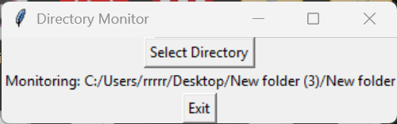

# Default filename 'download.jpg' Renamer  

## Description
This Python application provides a simple graphical user interface (GUI) to monitor a selected directory for the addition of a file named `download.jpg`. When detected, it automatically renames this file using a timestamp and a random 16-bit hexadecimal number, ensuring uniqueness.

## Features
- **GUI Directory Selection**: Easily select which directory to monitor.
- **Automatic File Renaming**: Detects and renames `download.jpg` immediately.
- **User-Friendly Interface**: Built with Tkinter for easy interaction.
- **Graceful Shutdown**: Includes an Exit button to safely stop monitoring.

## How to Use
1. **Run the script**:
    ```bash
    python monitor_rename_gui.py
    ```
2. Click **Select Directory** and choose the directory you'd like to monitor.
3. Once monitoring begins, place or download a file named `download.jpg` into that directory.
4. The file will automatically rename to a format like:
    ```
    20250320_152032_1A2B.jpg
    ```
5. To stop monitoring, click the **Exit** button.

## Requirements
- Python 3.x
- Tkinter library (usually included in standard Python installations)

## Example Output


